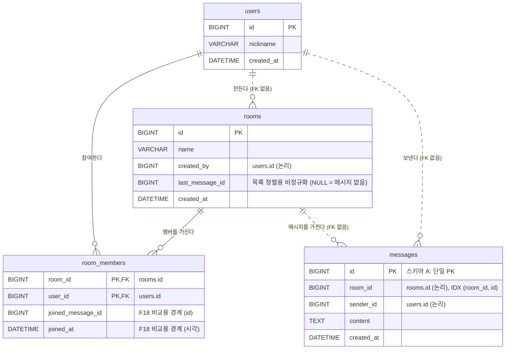

# ERD (IE 표기법)

> 2026-10-06 초안. ADR-007, 008, 010, 011, 013, 015(FK 혼합), 016(최근 대화순 정렬)을 반영했다.
> - 실선: 식별 관계 + FK 제약 있음
> - 점선: 비식별 관계, **FK 제약 없음** (애플리케이션이 보장하는 논리적 관계)



## 관계 설명

| 관계 | 카디널리티 | FK | 근거 |
|---|---|---|---|
| users → room_members | 1 : 0..N | O | 쓰기 빈도 낮음, 정합성 중요 |
| rooms → room_members | 1 : 0..N | O | F19(삭제된 방에 입장)를 DB가 차단 |
| rooms → messages | 1 : 0..N | X | 쓰기가 가장 많은 테이블. 저장 전 멤버 확인(ADR-011)으로 간접 보장 |
| users → messages | 1 : 0..N | X | 위와 같음 |
| users → rooms (created_by) | 1 : 0..N | X | 생성자 정보는 표시용. 정합성 요구 낮음 |

## 스키마 B (PK 실험용, ADR-013)

`messages`만 다르다.

```
messages_b
  room_id    BIGINT  PK (1)
  id         BIGINT  PK (2), AUTO_INCREMENT  ← InnoDB 제약으로 id 단독 인덱스 추가 필요
  sender_id  BIGINT
  content    TEXT
  created_at DATETIME
```
