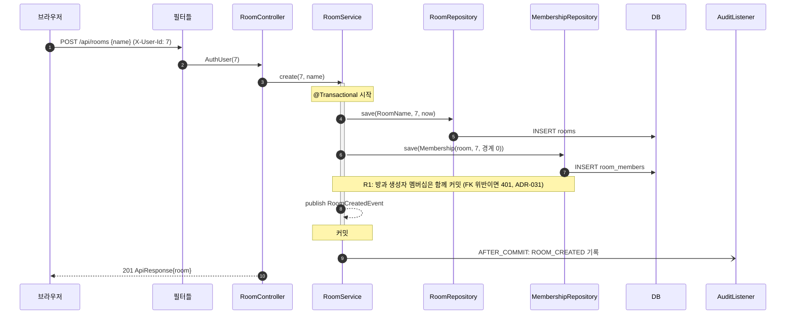
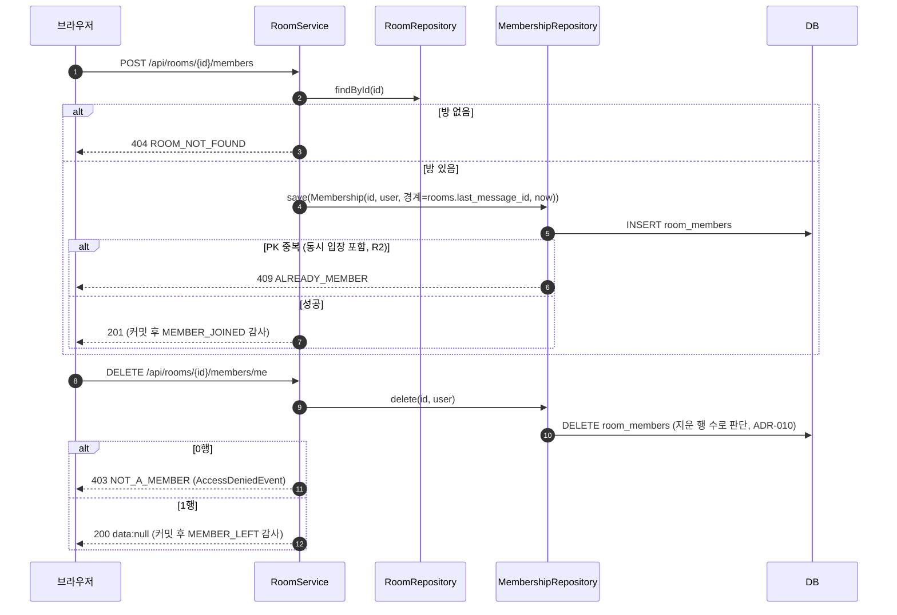
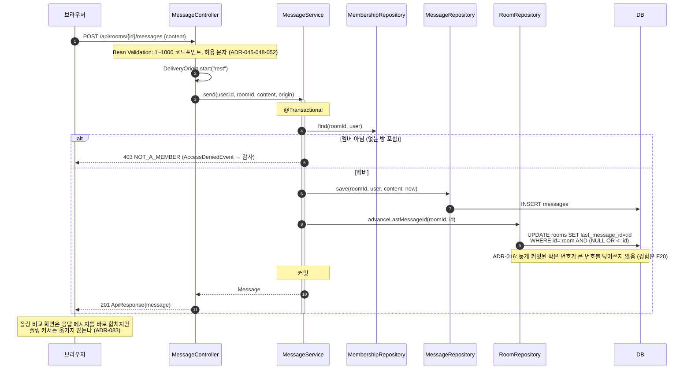
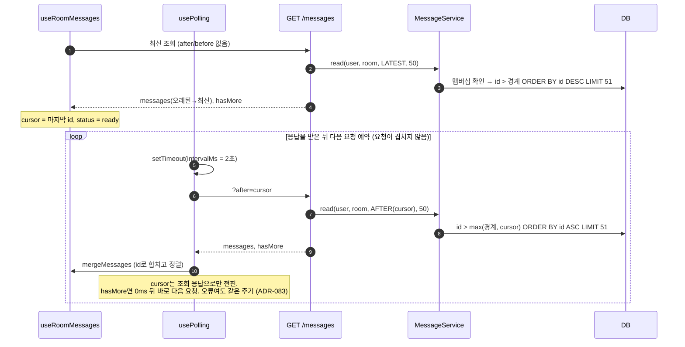
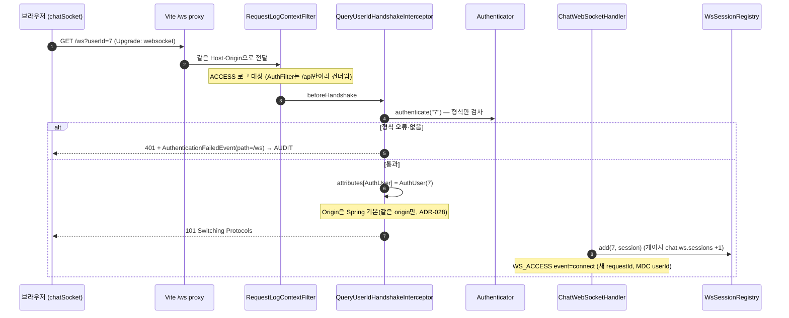
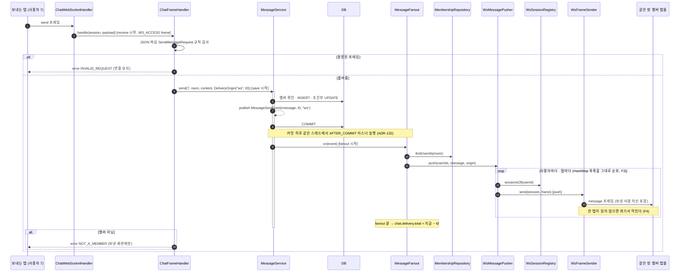
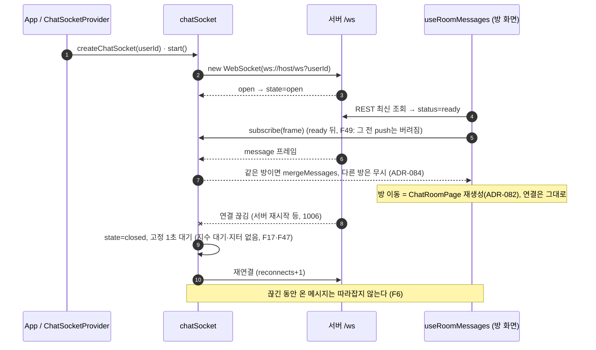

# 아키텍처 개요 (2026-10-08 기준)

> 요청 시 결과 보고서. 계획 1~6과 계획 7의 WebSocket 서버 1대 구현 현황을 한 문서에 그림으로 정리한다.
> 계획 7은 웨이브 1~5의 구현·통합 검증을 마쳤다. F3·F6은 브라우저 예비 관찰이 있고 F3~F6의 통제 실험은 진행 전이다. 진행 상태와 예상·관찰의 구분은 [계획서](../superpowers/plans/2026-10-08-plan7-websocket.md)와 [장애 실험 기록](../failure-lab.md)을 따른다.
> 상세 근거는 누적 문서([architecture.md](../design/architecture.md), [domain.md](../design/domain.md), [erd.md](../design/erd.md))와 ADR에 있다.

## 1. 한눈에 보기

| 항목 | 내용 |
|---|---|
| 목적 | 채팅 서버를 HTTP 폴링 → WebSocket → 서버 여러 대 → Redis로 키우면서, 장애를 먼저 겪고(ADR-034) 원인을 분석해 측정값으로 결정한다 |
| 현재 단계 | Step 2 계획 7의 단일 서버 WebSocket 수신·전송 구현 완료. REST API와 `?transport=polling` 비교 경로 유지. 계획 6의 UI 개편과 JDBC·JPA 구현 공존도 완료 |
| 다음 단계 | 계획 7 웨이브 6~9: F3 세션 저장소 동시성과 F6 재연결 누락의 예비 관찰 정량화, F4 느린 수신자와 F5 half-open 연결 재현·분석 |
| 백엔드 | Java 21, Spring Boot 4.1.1, 단일 모듈 `jissuo.chat`, `JdbcClient`(기본)·JPA(설정으로 선택), Flyway |
| DB | MySQL 8.4.11(13306) / PostgreSQL 18.6(15432). 메시지 스키마 A 유지, DB 선택은 보류(ADR-105·106) |
| 프론트 | React 19.3 + Vite 8.3 + TypeScript 6.0, hash 라우팅, 라이브러리 추가 없음 |
| 관측 | Actuator·Micrometer·Prometheus·Grafana, ECS JSON 로그 → Filebeat → Elasticsearch·Kibana |
| 쓰지 않는 것 | Spring Security(인증 흐름을 직접 보이려고), H2(잠금·커밋 동작이 실제 DB와 다름), STOMP(ADR-002) |

### 고도화 로드맵

```
 P6 UI 개편 + JDBC/JPA   P7 WebSocket 1대       P8 서버 여러 대         P9 Redis Pub/Sub
 ─────────[완료]──────▶ ───[구현 완료]───────▶ ──────[예정]─────────▶ ──────[예정]──────
 비교용 폴링 2초 유지      push 수신·WS 전송       다른 서버 사용자 미수신   사용자 채널로
 말풍선·스크롤·사이드바    F3·F6 예비 관찰         (F7, F8)                 서버 간 전달 (F9~F11)
```

## 2. 전체 구성도 (구현됨)

```
                         ┌──────────────────────────── 개발 PC ────────────────────────────┐
  브라우저 탭 (사용자별)  │                                                                   │
 ┌───────────────────┐   │  ┌──────────────────┐   /api/**    ┌─────────────────────────────┐ │
 │ React (hash 라우팅) │──┼─▶│ Vite dev 5173     │──proxy──────▶│ Spring Boot 8080            │ │
 │ sessionStorage:    │   │  │ (같은 origin,     │  xfwd:true   │  필터 → 컨트롤러 → 서비스    │ │
 │   chat.userId      │   │  │  ADR-028·086)     │              │  → 저장소(JDBC|JPA)         │ │
 │ 기본: WS push     │   │  └─────┬────────────┘              │  WebSocket → fan-out         │ │
 │ 비교: 2초 폴링    │   │     /ws│ proxy                      │  /actuator/{health,         │ │
 └───────────────────┘   │         └──────── WebSocket ──────▶│            prometheus}      │ │
                         │                                     └──────┬──────────┬───────────┘ │
                         │                       JDBC (Hikari)        │          │ logs/*.json  │
                         │            ┌───────────────────────────────┘          │              │
                         │            ▼                                          ▼              │
                         │  ┌─────────────────────┐   ┌──────────────────┐  ┌──────────────┐   │
                         │  │ Docker: compose.db  │   │ compose.monitoring│  │ Filebeat     │   │
                         │  │  MySQL 8.4  :13306  │   │  Prometheus 19090 │◀─┤  (logs 프로필)│   │
                         │  │  Postgres 18:15432  │   │  Grafana   13000  │  │ → ES 19200   │   │
                         │  │  (같은 CPU·메모리)   │   │  (metrics 프로필) │  │ → Kibana 15601│   │
                         │  └─────────────────────┘   └──────────────────┘  └──────────────┘   │
                         └───────────────────────────────────────────────────────────────────┘
```

- 브라우저는 5173 하나와만 통신한다. CORS와 `X-User-Id`로 인한 preflight(폴링 요청 두 배)가 없다(ADR-028).
- 부하 실험은 `infra/compose.bench.yml`과 `load/`(k6)로 백엔드에 직접 요청한다(브라우저가 아니라 CORS 무관).

## 3. 백엔드 구조 (구현됨)

### 3.1 패키지와 계층

```
jissuo.chat
 ├─ room/     ┐                ┌ api/          컨트롤러, 요청·응답 DTO
 ├─ message/  ├ 기능 × 4계층 ──┤ application/  서비스(트랜잭션 경계, 흐름)
 ├─ user/     ┘                ├ domain/       record·규칙·저장소 인터페이스 (Spring 모름)
 │                             └ infra/jdbc|jpa 저장소 구현 (설정으로 하나만 빈 등록)
 ├─ auth/     AuthFilter, Authenticator, HeaderUserIdAuthenticator, AuthUser, @CurrentUser
 ├─ audit/    AuditListener (AUDIT 로거, 아무도 audit을 import하지 않음)
 └─ common/   ApiResponse, ErrorCode, ChatException, GlobalExceptionHandler,
              RequestLogContextFilter, ChatProperties, ClockConfig
```

### 3.2 의존 방향 (ArchUnit으로 자동 검사)

```
        api ──────▶ application ──────▶ domain ◀────── infra
         │                                 ▲
         └──────── (infra 금지) ───────────┘ (domain은 Spring·common·auth도 모름)

  기능 사이:  message ──▶ room.domain  (허용, RoomService 호출은 금지)
              room ──X──▶ message
              room, message ──X──▶ user   (userId 값과 DB FK로만 연결)
              user ──X──▶ room, message
  기술:       auth ──X──▶ *.domain,   (누구도) ──X──▶ audit
  보호 API:   /api/** (단 /api/dev/** 제외) 핸들러는 @CurrentUser AuthUser 파라미터 필수
```

### 3.3 애그리거트와 테이블

```
  ┌────────── room 패키지 ──────────┐        ┌──── message 패키지 ────┐     ┌─ user ─┐
  │ Room            Membership      │        │ Message                │     │ User   │
  │ (rooms)         (room_members)  │        │ (messages | messages_b)│     │(users) │
  └─────────────────────────────────┘        └────────────────────────┘     └────────┘
           서로 id로만 참조한다. FK는 room_members → rooms, users 에만 (ADR-015)

  users(id, nickname, created_at)
  rooms(id, name, created_by, last_message_id ← 목록 정렬용 비정규화, created_at)
  room_members(PK(room_id, user_id), joined_message_id, joined_at)   ← 나가기 = 행 삭제
  messages  스키마 A: PK(id), IDX(room_id, id)        ← 기본
  messages_b 스키마 B: PK(room_id, id)                 ← PK 비교 실험용
```

### 3.4 설정으로 고르는 구현

| 설정 | 값 | 기본 | 의미 |
|---|---|---|---|
| `chat.repository` | `jdbc` \| `jpa` | `jdbc` | 저장소 구현. JPA는 메시지 스키마 A만 지원(다르면 기동 실패) |
| `chat.message-schema` | `A` \| `B` | `A` | messages PK 비교 |
| `chat.join-boundary` | `id` \| `time` | `id` | 재입장 경계: `joined_message_id` / `joined_at` (ADR-100: id 유지) |
| profile 환경 | `local` \| `bench` \| `prod` | | 로그 레벨·`/actuator/loggers` 공개 여부(ADR-022). bench는 ACCESS 로그 OFF |
| profile DB | `mysql` \| `postgres` | | 접속 주소와 Flyway 스크립트 위치(`db/migration/{mysql,postgresql}`) |

### 3.5 REST API

| 기능 | 요청 | 성공 | 주요 실패 |
|---|---|---|---|
| 개발용 사용자 생성 | `POST /api/dev/users {nickname}` (local·bench만, 인증 제외) | 201 | 400 |
| 사용자 조회 | `GET /api/users?ids=1,2,3` (최대 100) | 200 | 400 |
| 방 생성 (+생성자 입장) | `POST /api/rooms {name}` | 201 | 400, 401(없는 사용자) |
| 방 목록 (최근 대화순) | `GET /api/rooms?cursor=&size=20` (최대 50) | 200 | 400 |
| 입장 | `POST /api/rooms/{id}/members` | 201 | 404 방 없음, 409 이미 멤버 |
| 나가기 | `DELETE /api/rooms/{id}/members/me` | 200 `data:null` | 403 |
| 메시지 전송 | `POST /api/rooms/{id}/messages {content}` | 201 | 400, 403 |
| 메시지 조회 | `GET /api/rooms/{id}/messages?after=` \| `?before=` \| (없으면 최신) `&size=50` | 200 | 400(둘 다), 403 |

- 응답은 모두 `ApiResponse{success, data, error{code, message}}`이고 HTTP 상태는 실제 결과대로 준다(ADR-020).
- 메시지 응답은 항상 오래된 것 → 최신 순이고 `hasMore`가 있다. 서비스는 `size+1`건을 읽어 더 있는지 판단한다.

## 4. 요청 처리 흐름 (구현됨)

### 4.1 모든 HTTP 요청이 지나는 길 (ASCII)

```
요청 ──▶ RequestLogContextFilter (가장 먼저)
           │  MDC requestId = 새 UUID (클라이언트 헤더 무시), clientIp, 응답 헤더 X-Request-Id
           ▼
         AuthFilter  (/api/** 중 /api/dev/** 제외)
           │  X-User-Id ──▶ Authenticator(형식만 검사, DB 조회 없음)
           │     ├─ 실패: AuthenticationFailedEvent 발행 → 401 ApiResponse 직접 작성 ──┐
           │     └─ 성공: request 속성 AuthUser, MDC userId                            │
           ▼                                                                         │
         DispatcherServlet → @CurrentUser AuthUser → 컨트롤러 → 서비스(@Transactional) │
           │                                         └─ 예외 → GlobalExceptionHandler │
           │  요청 처리 중: AuditListener → AUDIT (성공은 커밋 뒤, 실패는 종료 뒤·트랜잭션 없으면 즉시)
           ▼                                                                         │
         finally: ACCESS 한 줄(method, path, query, status, durationMs) ◀────────────┘
                  (bench에서는 OFF, /actuator/** 제외) → MDC 정리
```

### 4.2 방 생성



### 4.3 입장과 나가기



- 재입장 경계(`joined_message_id`) 이후 메시지만 보인다(R4, ADR-008·011). 입장 시점의 `last_message_id`를 경계로 저장한다.

### 4.4 메시지 전송 (REST 비교 경로, 기본 WebSocket은 8.5절)



- REST 전송도 커밋 뒤 같은 `MessageFanout` 경로로 WebSocket 연결에 push한다. 메시지 전송은 감사 대상이 아니다(본문은 개인정보, ADR-023).

### 4.5 비교용 폴링 수신 (`?transport=polling`, 프론트 `usePolling` + 백엔드 조회)



- 커서 방식이라 보는 중에 새 메시지가 와도 offset처럼 밀리지 않는다(F15). 대신 커밋 순서가 id 순서와 다르면 늦게 커밋된 작은 id를 영영 건너뛸 수 있다(F22, 의도적으로 열어 둠).

## 5. 프론트엔드 구조 (구현됨)

```
App (사용자 없으면 LoginPage)
 └─ NicknameProvider (key=userId)           탭 안 닉네임 캐시, GET /api/users?ids
     └─ ChatSocketProvider (key=userId)     기본 통로에서 사용자당 탭 연결 1개, 폴링 모드에서는 비활성
         └─ .app [data-view = rooms | room]  좁은 화면은 한 화면씩 (ADR-107)
             ├─ header  사용자 #id · 사용자 바꾸기
             └─ .shell
                 ├─ RoomListPage (사이드바)       목록·더 보기·새로고침·방 만들기, 자동 갱신 없음 (ADR-084)
                 └─ main
                     └─ ChatRoomPage key=roomId   방을 옮기면 상태를 새로 시작 (ADR-082)
                         ├─ useRoomMessages        최초 조회·WS 수신/전송·이전 메시지·입장·나가기 (ADR-108)
                         │    └─ usePolling        ?transport=polling에서만 실행 (ADR-083)
                         ├─ useChatScroll          맨 아래 따라가기, "새 메시지 N개", 위에 붙일 때 위치 보정
                         ├─ MessageList            chatItems: 날짜 구분선·말풍선·연속 이름 생략
                         ├─ Composer               textarea, Enter 전송 / Shift+Enter 줄바꿈 / 조합 중 무시
                         └─ <details> 연결 상태     ConnectionPanel: 상태·재연결·프레임 수·종료 코드
                             또는 폴링 상태        PollingPanel: 주기, 커서, 요청·오류 수, X-Request-Id
```

- 라우팅: `#/rooms`, `#/rooms/{id}`. 사용자 id는 탭별 `sessionStorage`(`chat.userId`).
- 오류 문구: 서버의 한국어 메시지만 보이고 코드는 숨긴다. 네트워크 오류·JSON 아님은 "서버에 연결할 수 없습니다…"(ADR-118).
- 장애 선행: 전송 중 버튼 비활성화·낙관적 표시를 넣지 않았다(F33).

## 6. 관측 (구현됨)

```
                    ┌──────────── Spring Boot ────────────┐
요청 ──▶ ACCESS ────┤ app.json  (ECS JSON, 10MB·3일)       ├──▶ Filebeat ──▶ ES app-*   ──▶ Kibana
감사 ──▶ AUDIT  ────┤ audit.json(ECS JSON, 10MB·30일)      ├──▶ Filebeat ──▶ ES audit-* ──▶ Kibana
                    │ /actuator/prometheus                 │◀── Prometheus(5초) ──▶ Grafana "chat Step 1"
                    └──────────────────────────────────────┘
  HTTP는 같은 requestId로 ACCESS·일반 로그·AUDIT를 잇는다. WebSocket 이벤트는 WS_ACCESS에 별도 requestId를 붙인다.
  비교용 폴링 화면의 패널에도 X-Request-Id가 보인다.
  태그: application=chat, db=mysql|postgres, schema=A|B
```

| 지표 | 쓰임 |
|---|---|
| `http_server_requests_seconds_*` (히스토그램) | URI별 TPS, p50/p95/p99, 4xx·5xx |
| `hikaricp_connections_*` | 풀 포화·대기(F1) |
| Tomcat 스레드, JVM 힙 | 부하 실험 보조 |
| `chat.ws.sessions`, `chat.ws.frames{type}` | WebSocket 연결 수와 프레임 수 |
| `chat.delivery.stage{stage,transport}`, `chat.delivery.total{transport}` | 전달 단계별·전체 지연 |

## 7. 테스트 구조 (구현됨)

```
./gradlew test (Testcontainers, @Tag("experiment") 제외)
 ├─ 단위        도메인 값 객체, 커서, 인증, ApiResponse, 예외 변환, 필터
 ├─ 계약        *RepositoryContract  : JDBC 2DB × 스키마 A/B, JPA 2DB × 스키마 A
 │              *ApiContract (MockMvc): 같은 HTTP 계약을 두 DB × 구현에서
 ├─ 구조        ArchitectureTest (의존 방향, 보호 API 인증 파라미터)
 ├─ WebSocket   핸드셰이크, 멤버/비멤버 전송, fan-out, 프레임·접근 로그, 타이머
 ├─ 관측        프로필별 로그 레벨, actuator 노출, 감사 로그, 요청 ID
 └─ 스키마·SQL  Flyway 마이그레이션, db/ 스크립트를 DB 클라이언트로 실행
./gradlew experimentTest  커밋 순서(F22), 입장 경계(F18), 나가기·전송(F23), 마지막 나가기(F19),
                          시각 커서(F2), SQL 횟수(JDBC vs JPA)
frontend: Vitest 106건 + Playwright E2E 5건 (WebSocket 대화·재입장, 폴링 회귀, 비멤버, 375px·다크, 스크롤)
load/:    k6 W1~W5 부하 (계획 5b), W1~W5의 JDBC·JPA 비교는 연기 (ADR-128)
```

---

## 8. 계획 7: WebSocket 서버 1대 (웨이브 1~5 구현 완료, F3~F6 통제 실험 전)

> ADR-130~141과 [계획서](../superpowers/plans/2026-10-08-plan7-websocket.md)의 현재 진행 상태 기준이다. F3·F6에는 브라우저 예비 관찰이 있지만 발생 조건·빈도는 통제 실험으로 검증해야 한다. 나머지 F 번호도 표에 적힌 상태에 따라 가설과 관찰을 구분한다.

### 8.1 바뀌는 구성 (ASCII)

```
 브라우저 탭                          Vite 5173                     Spring Boot 8080
┌─────────────────────────┐         ┌──────────────┐  /api/** ┌──────────────────────────────────────┐
│ App                      │  REST   │              │─────────▶│ 기존 REST (그대로 유지)               │
│  └ ChatSocketProvider ───┼────────▶│ /api proxy   │          │                                      │
│     (탭당 연결 1개,       │  WS     │ /ws proxy    │  /ws     │ QueryUserIdHandshakeInterceptor      │
│      방을 옮겨도 유지)    │═══════▶│ (ws: true)   │═════════▶│  → ChatWebSocketHandler               │
│  └ ChatRoomPage          │         └──────────────┘          │     ├ WsSessionRegistry (HashMap, F3) │
│     └ useRoomMessages    │                                    │     └ ChatFrameHandler → MessageService│
│        수신: 소켓 구독    │◀════════ message / error 프레임 ═══│ MessageFanout (AFTER_COMMIT, 동기)    │
│        전송: 소켓 send    │                                    │  → WsMessagePusher → WsFrameSender    │
│  ?transport=polling이면  │                                    └──────────────────────────────────────┘
│  기존 폴링 (Step 6 비교) │
└─────────────────────────┘
```

| 바뀌는 것 | 그대로인 것 |
|---|---|
| 수신: 2초 폴링 → push (기본) | 최초 조회·이전 메시지·입장·나가기는 REST |
| 전송: WS `send` 프레임 (REST 전송도 유지) | REST API 계약, k6, ApiResponse |
| 상태 패널: "연결 상태"(연결·재연결·프레임 수·종료 코드) | `usePolling`·`merge`·`PollingPanel` 코드 |
| 새 로그 `WS_ACCESS`, 새 지표 `chat.ws.*`, `chat.delivery.*` | ACCESS·AUDIT·예외 로그 (ADR-136) |

### 8.2 백엔드 패키지 추가

```
auth/QueryUserIdHandshakeInterceptor        쿼리 userId → Authenticator → 세션 속성 AuthUser
common/metrics/@DeliveryStage, DeliveryTimingAspect     단계별·전체 전달 시간 (AOP)
message/domain/MessageSentEvent, DeliveryOrigin         Spring 없는 record
message/application/MessagePusher(인터페이스), MessageFanout
message/api/ws/ WebSocketConfig, ChatWebSocketHandler, ChatFrameHandler, WsSessionRegistry,
                WsMessagePusher, WsFrameSender, WsAccessLogAspect, 프레임 record들
room/domain/MembershipRepository.findUserIds(roomId)    (JDBC·JPA 구현 추가)

의존: message.api.ws ──▶ message.application ──▶ message.domain ──▶ (room.domain)
      application은 WebSocket을 모른다 (MessagePusher 인터페이스만)
```

### 8.3 프로토콜

```
C→S  {"type":"send","roomId":1,"content":"안녕"}
S→C  {"type":"message","message":{"id":10,"roomId":1,"senderId":7,"content":"안녕","createdAt":"..."}}
S→C  {"type":"error","roomId":1,"code":"NOT_A_MEMBER","message":"이 채팅방의 멤버가 아닙니다."}   (보낸 세션에만)

- 응답 짝 맞춤 id 없음 (중복 방지 키로 번지지 않게, ADR-034·F33). 보낸 사람도 message push로 받는다
- 잘못된 JSON·모르는 type·검증 실패 → INVALID_REQUEST error, 연결 유지
- 없는 방도 NOT_A_MEMBER (서비스는 멤버 행으로만 판단, REST와 같음)
```

### 8.4 핸드셰이크와 인증



### 8.5 WS 전송 → fan-out (동기)



- REST `POST /messages`도 `DeliveryOrigin("rest")`로 같은 경로(MessageService → 이벤트 → MessageFanout)를 탄다. 차이는 진입점과 응답(201)뿐이다.
- push 예외를 잡지 않는다. `AFTER_COMMIT` 리스너 예외는 Spring이 커밋 후 로그에 남기므로 저장과 REST 201은 유지되고 일부 수신자에게 push가 빠질 수 있다(F44 가설). 실패 주입을 통한 응답·수신 범위 확인은 작업 10에 남아 있다.

### 8.6 전달 시간 측정 (AOP, 단계가 겹친다)

```
  t0 (DeliveryOrigin.startedNanos)
  │
  ├── receive ─────────────────────────────────────────────────────────────┤  REST 컨트롤러 / ChatFrameHandler
  │    ├── save ──────────────────────────────────────────────────────┤     MessageService.send (트랜잭션 바깥에서 잼)
  │    │    [멤버 확인 · INSERT · UPDATE · COMMIT]                     │     → 동기라 커밋 뒤 fanout까지 포함
  │    │                        ├── fanout ────────────────────────┤  │     MessageFanout.on
  │    │                        │   ├─ push ─┤ ├─ push ─┤ ├─ push ─┤  │     WsFrameSender.send (세션마다)
  │    │                        │                                  ▼
  │    │                        │                        chat.delivery.total{transport} = 여기 − t0
  지표: chat.delivery.stage{stage=receive|save|fanout|push, transport=rest|ws|internal}  (히스토그램)
        비동기로 바꾸면 save·receive는 짧아지고 total은 같은 뜻으로 남는다 → 같은 지표로 비교
```

열린 수신 세션이 0개여서 `push` 표본이 없어도 fan-out이 정상 종료되면 `total`을 기록한다. 이 지표는 브라우저 표시 확인이 아니다(ADR-129).

### 8.7 프론트 연결 수명



### 8.8 관측 추가

| 이름 | 종류 | 내용 |
|---|---|---|
| `chat.ws.sessions` | 게이지 | 저장소의 세션 수 (half-open이면 줄지 않음, F5) |
| `chat.ws.frames{type}` | 카운터 | 받은 `send`·`invalid`, 보낸 `message`·`error` |
| `chat.delivery.stage{stage,transport}` | 타이머(히스토그램) | 8.6의 단계별 시간 |
| `chat.delivery.total{transport}` | 타이머(히스토그램) | 진입 → fan-out 정상 종료 (열린 세션 0개여도 기록) |
| `WS_ACCESS` 로그 | 로그 | `event`(connect·frame·close), `sessionId`, `frameType`, `roomId`, `result`, `durationMs`, `closeCode` + MDC `requestId`(이벤트마다 새 UUID)·`userId`. bench에서 OFF |

AOP를 쓰지 않는 것(ADR-136): ACCESS(필터라 401·404까지 잡음), AUDIT(커밋 시점을 지켜야 함), 예외 로그(`GlobalExceptionHandler` 한 곳, 두 번 기록 방지).

### 8.9 일부러 열어 두는 문제 (장애 선행, ADR-034)

| 번호 | 열어 두는 방식 | 재현 작업 |
|---|---|---|
| F3 | 세션 저장소 `HashMap<Long, ArrayList>`; 탭 동시 접속 중 `ConcurrentModificationException` 1건 예비 관찰 | 작업 9 → 조건·빈도 정량화 뒤 보완안 제안 |
| F4 | 보내는 스레드에서 동기 push 루프 | 작업 10 (읽지 않는 클라이언트) |
| F5 | ping/pong·유휴 시간 제한 없음 | 작업 11 (조용히 끊는 TCP 프록시) |
| F6 | 재연결 뒤 따라잡기 없음; Offline→Online 후 메시지 누락 예비 관찰 | 작업 12에서 조건을 통제해 재측정 |
| F43 | 같은 세션 동시 `sendMessage` (TEXT_PARTIAL_WRITING) | 작업 10 중 관찰 |
| F44 | AFTER_COMMIT push 예외 → 저장·REST 201 유지, 일부 수신자 push 누락 가능(실패 주입 미검증) | 작업 10 중 관찰 |
| F45 | push 도착 순서 ≠ id 순서 (F22 계열) | 두 탭 동시 전송 |
| F46 | 나가기 커밋과 멤버 조회 경쟁 → 나간 탭에 push (F23 계열) | 나가기·전송 동시 |
| F47 | 1초 고정 재연결이 재시작 때 몰림 (F17 연결) | 브라우저 확인 |
| F48 | 타이머 aspect 오버헤드 | 이후 부하 비교 |
| F49 | 최초 조회와 구독 사이 push 유실 | 작업 12와 함께 |

### 8.10 실행 순서 (웨이브)

```
웨이브 1: [1 WS 기반] [2 findUserIds] [5 프론트 소켓]        완료
웨이브 2: [3 fan-out]  [6 프론트 수신 전환]                완료
웨이브 3: [4 WS 전송]  [7 프론트 전송 전환]                완료
웨이브 4: [13 AOP 측정·WS 로그]                           완료
웨이브 5: [8 E2E·브라우저·기록(ADR-130~141, F43~)]       완료
웨이브 6~9: [9 F3] → [10 F4] → [11 F5] → [12 F6]   통제 실험 전 (각 웨이브에서 측정값·예상 구분 보고)
```

## 9. 이후 단계에서 이 구조가 바뀔 곳 (예고)

- **P8 서버 여러 대**: `WsSessionRegistry`는 서버 메모리라서, 다른 서버에 붙은 멤버에게 push가 가지 않는다(F7). nginx 뒤 WebSocket 업그레이드·sticky 문제(F8).
- **P9 Redis**: `MessagePusher` 구현이 "로컬 세션에 직접 쓰기"에서 "사용자 채널에 발행 → 각 서버가 구독해 로컬 세션에 쓰기"로 바뀐다. application 계층은 인터페이스만 알므로 바뀌지 않는다.
- 인증은 `Authenticator` 구현만 JWT로 바꾸면 HTTP와 WebSocket이 함께 바뀐다(ADR-006).
